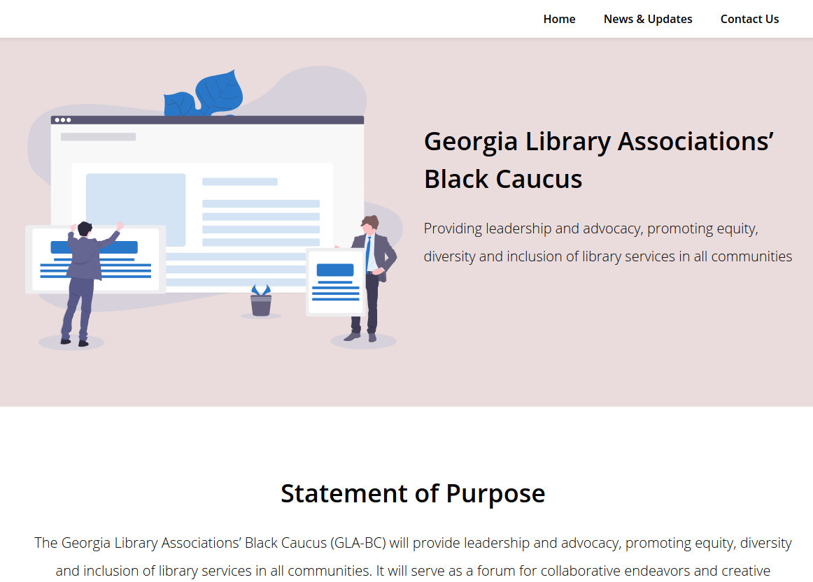
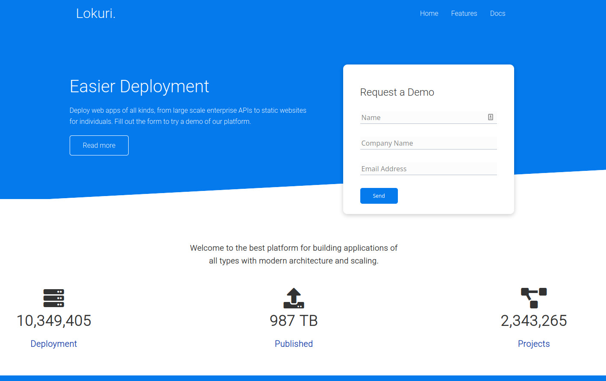
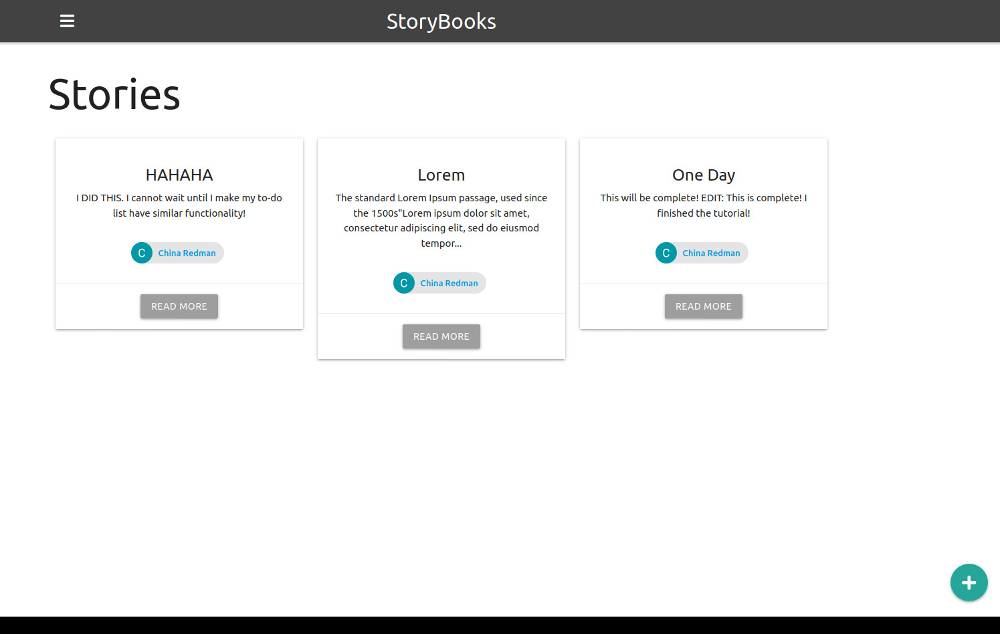

    
    
    

## Works In Progress
<table>
    <tr>
        <td width="50%">
            <h3>Georgia Library Associations' Black Caucus Interest Group Website</h3>
            
 
                <strong> Tech Used: </strong> AirTable and Softr.  
                <strong> Purpose: </strong> This website will be used to distribute newsletters, professional development opportunities, and other resources to BIPOC librarians and library paraprofessionals in Georgia.  
                 <strong> Links: </strong> <a target="_blank" href="https://blackcaucusgla.preview.softr.io/?t=1617197530749">Site</a>  
            

            
        </td>
        <td width="50%">
            <h3>Lokuri Website</h3>
            
 
                <strong> Tech Used: </strong> HTML, CSS Grid, CSS Animation, and Flexbox.  
                <strong> Purpose: </strong> Lorkui is a responsive website for software that will be used to deploy web applications of all kinds.  
                <strong> Links: </strong>  <a target="_blank" href="https://github.com/xcChinaxc/lokuri-cr-responsive-website">Repo</a> // 
                <a target="_blank" href="https://focused-heisenberg-9d8dca.netlify.app/">Demo Site</a>  
            

            
        </td>
    </tr>
    <tr>
        <td width="50%">
            <h3>To Do Application</h3>
            
 
                <strong> Tech Used: </strong> HTML, CSS, JavaScript, Embedded JavaScript, Node.js, Express, MongoDB.  
                <strong> Purpose: </strong> Use this application to create, mark complete, and delete to-do items.  
                <strong> Links: </strong>   <a target="_blank" href="https://github.com/xcChinaxc/to-do-app">Repo</a> // 
                <a target="_blank" href="https://cr-to-do-app.herokuapp.com/">Demo Site</a>  
            

            
        </td>
        <td width="50%">
            <h3>StoryBooks App</h3>
            
 
                <strong> Tech Used: </strong> HTML, CSS, JavaScript, Express, MongoDB, Mongoose, Passport, Google OAuth, Sessions, and Handlebars.  
                <strong> Purpose: </strong> StoryBooks is a web application that users can use to create public and private stories.  
                <strong> Links: </strong>  <a target="_blank" href="https://github.com/xcChinaxc/storybooks">Repo</a>
            

            
        </td>
    </tr>
            
</table>

## Languages and Tools:

        

