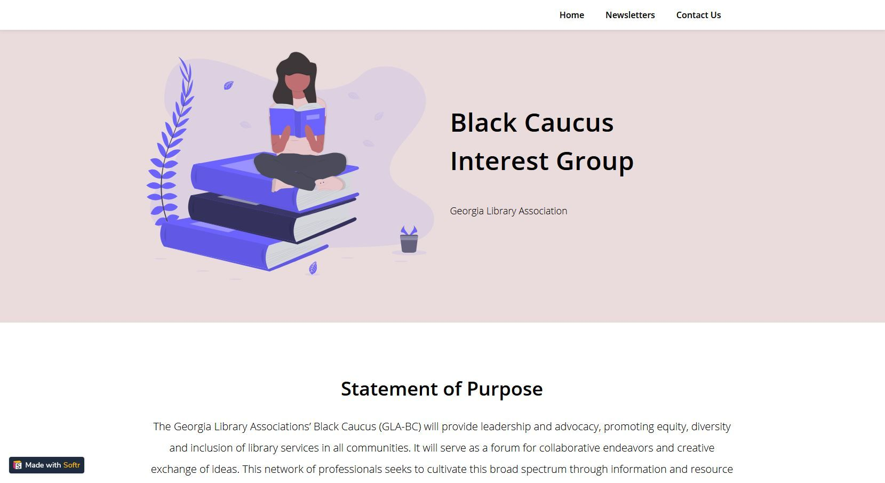
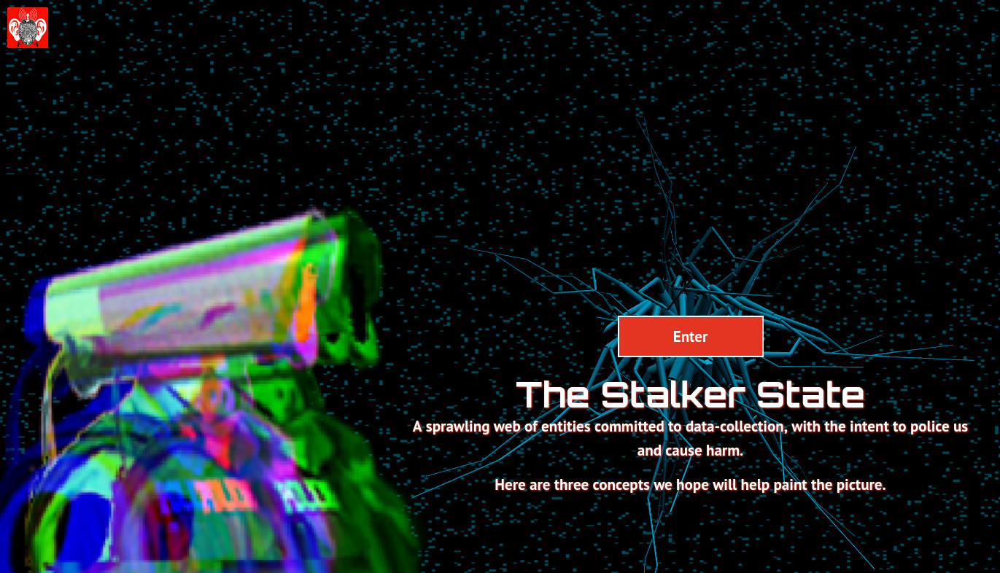
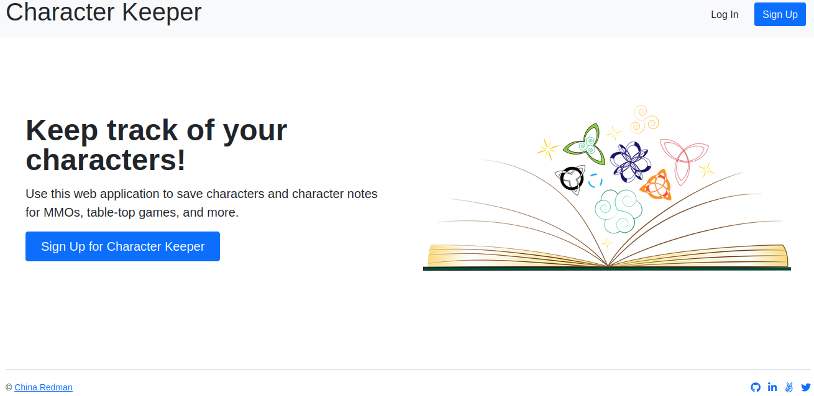

## Connect with me

    
    
    

    
    
## Languages and Tools:

     
    
    
     
     
     
     

## Projects
<table>
    <tr>
        <td width="50%">
            <h3>Resource Sharing with GLA's Black Caucus Interest Group</h3>
            
 
                A responsive website for distributing resources to librarians and library paraprofessionals.  
                <strong> Tech Used: </strong> AirTable and Softr. <a target="_blank" href="https://blackcaucusgla.softr.io/">View website</a>.
            

            
        </td>
        <td width="50%">
            <h3>Curating a Digital Experience</h3>
            
 
                Digital experience to aid the <a href="https://stoplapdspying.org/wp-content/uploads/2018/05/Before-the-Bullet-Hits-the-Body-May-8-2018.pdf">Before the Bullet Hits the Body</a> report. 
                <strong> Tech Used: </strong> WordPress, PHP, and JavaScript. <a href="https://thestalkerstate.org/">View website</a>.
            

            
        </td>
    </tr>
    <tr>
        <td width="50%">
            <h3>MVP Building with 100Devs</h3>
            

                Allows users to sign in to their account, upload and favorite images, and post comments.  
                <strong> Tech Used: </strong> JavaScript, EJS, Express, and Mongoose.
            

            
        </td> 
         <td width="50%">
            <h3>Amplifying Gaming Sessions</h3>
            
 
                Full-stack application to track character notes for MMOs, table-top games, and more.  
                <strong> Tech Used: </strong> JavaScript, Bootstrap, Cloudinary, and Heroku.  
            

            
        </td>
    </tr>
</table>
