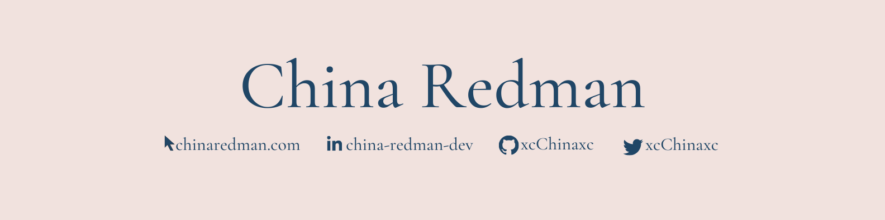

## Connect with me

    
    
    

## Projects
<table>
    <tr>
        <td width="50%">
            <h3>Georgia Library Associations' Black Caucus Interest Group Website</h3>
            
 
                <strong> Purpose: </strong> This website will be used to distribute newsletters, professional development opportunities, and other resources to BIPOC librarians and library paraprofessionals in Georgia.  
                 <strong> Links: </strong> <a target="_blank" href="https://blackcaucusgla.softr.io/">Site</a>  
            

            
        </td>
        <td width="50%">
            <h3>The Stalker State Website</h3>
            
 
                <strong> Purpose: </strong> This website is being used to inform others about the stalker state. The Stalker State is the information gathering, storing, and sharing environment we are all immersed in.  
                <strong> Links: </strong>  <a target="_blank" href="https://github.com/xcChinaxc/slsc-splash/tree/main">Repo</a> //
                <a target="_blank" href="https://thestalkerstate.org/">Site</a>  
            

            
        </td>
    </tr>
    <tr>
        <td width="50%">
            <h3>T.7.Q.A.R. - Team 7 Queen Anne's Revenge</h3>
            

                <strong> Purpose: </strong> T.7.Q.A.R is a social media clone that allows users to sign into their account to upload images that can be liked by other users. T.7.Q.A.R stands for Team 7 Queen Anne's Revenge - latter half being based off of Blackbeards ship name.  
                <strong> Links: </strong>  <a target="_blank" href="https://github.com/xcChinaxc/T.7.Q.A.R">Repo</a> //
                <a target="_blank" href="https://t7qar.herokuapp.com">Demo Site</a>  
            

            
        </td> 
         <td width="50%">
            <h3>To Do Application</h3>
            
 
                <strong> Purpose: </strong> Use this application to create, mark complete, and delete to-do items.  
                <strong> Links: </strong>   <a target="_blank" href="https://github.com/xcChinaxc/to-do-app">Repo</a> // 
                <a target="_blank" href="https://cr-to-do-app.herokuapp.com/">Demo Site</a>  
            

            
        </td>
    </tr>
</table>

## Languages and Tools:

     
    
    
     
     
     
     

